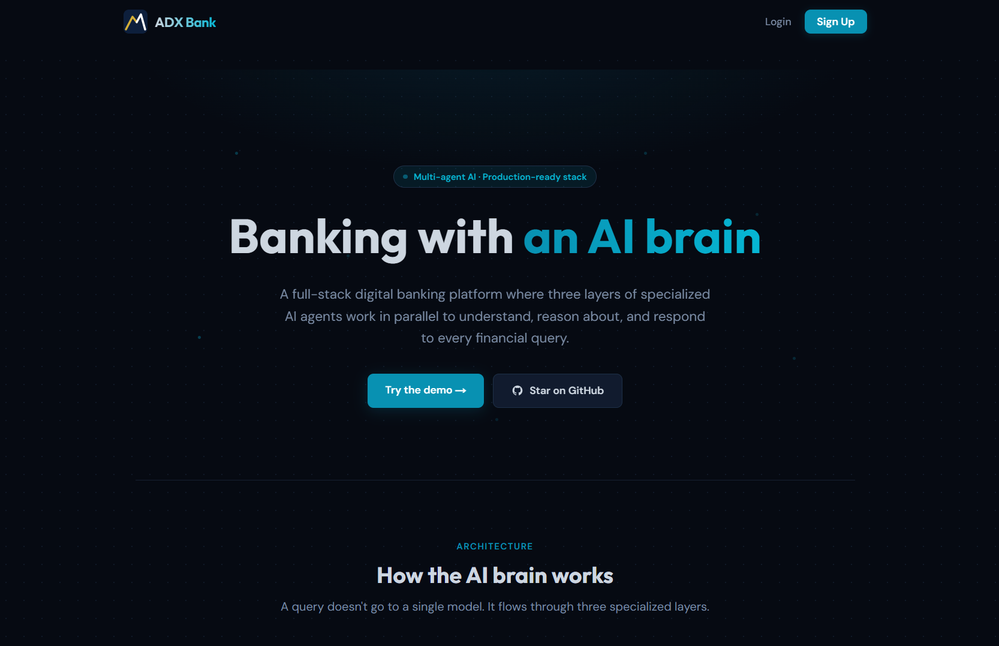
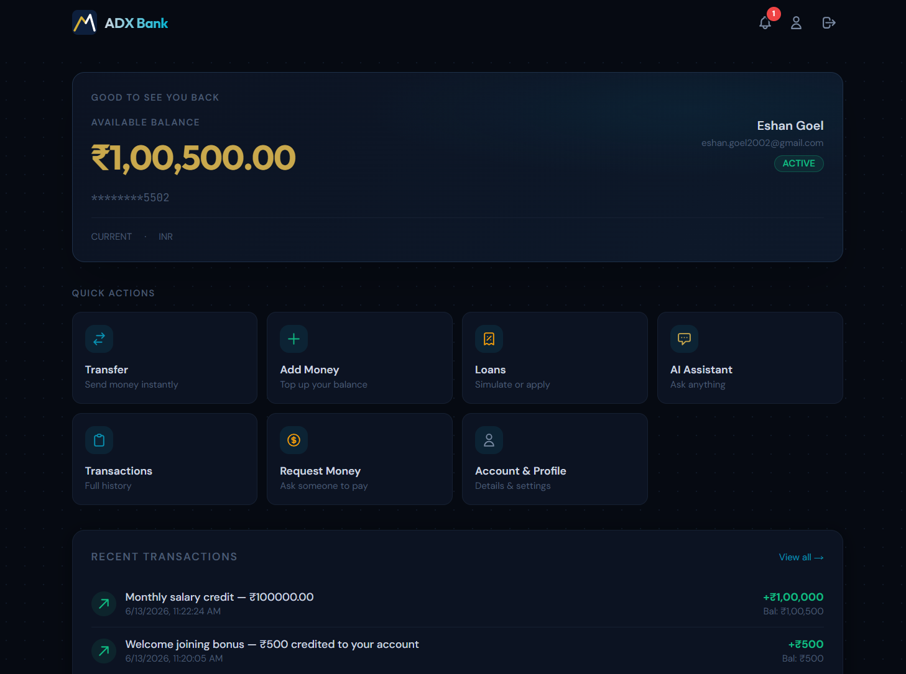
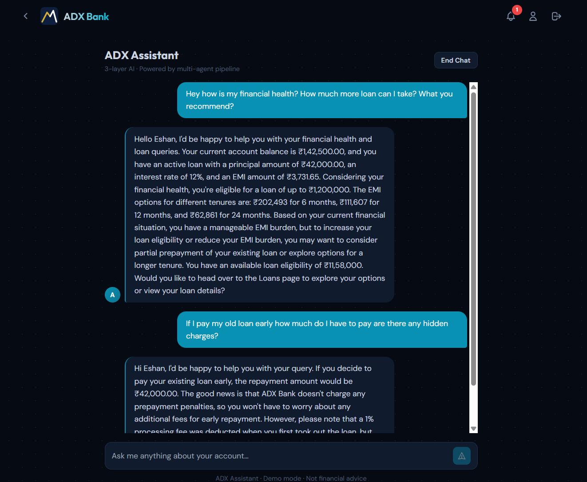
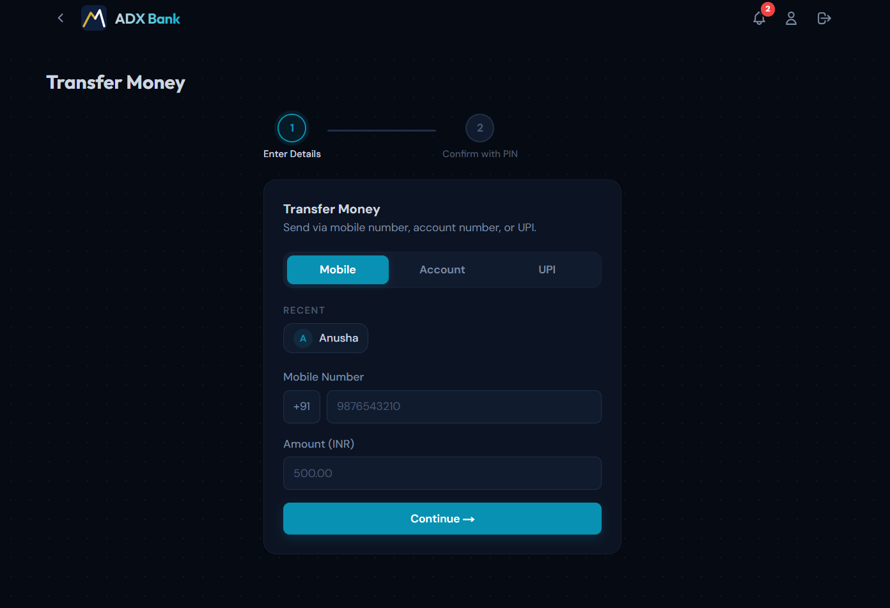
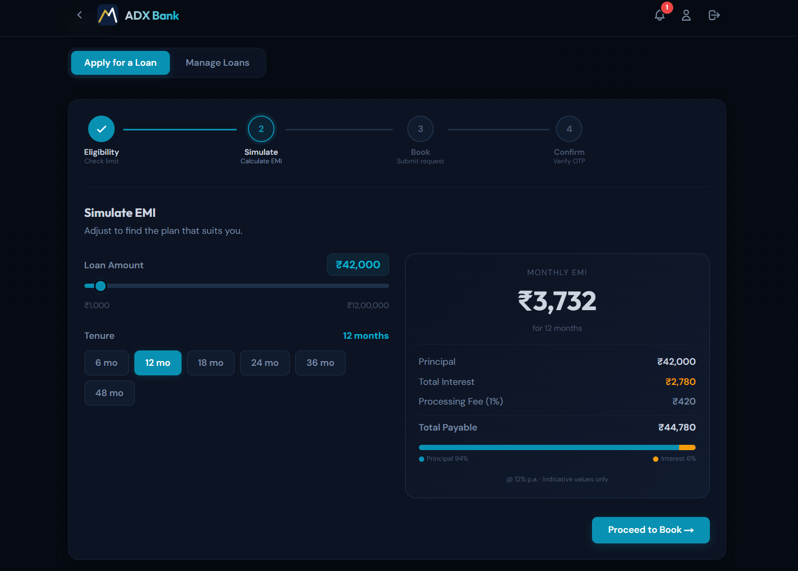
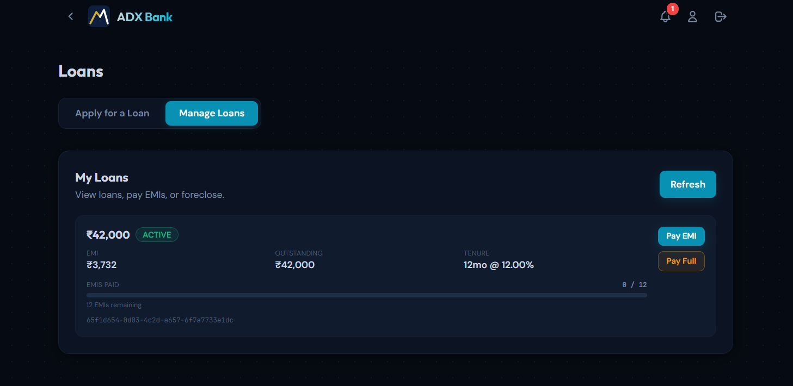
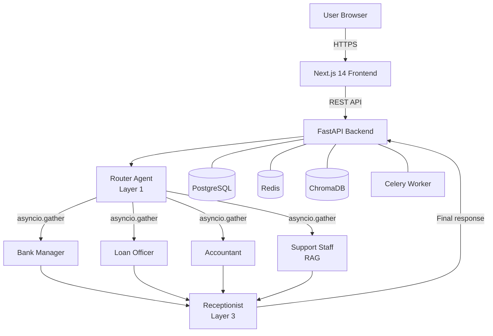

<div align="center">


# ADX Bank

**AI-powered digital banking platform with a 3-layer multi-agent brain**

[](https://python.org)
[](https://nextjs.org)
[](https://fastapi.tiangolo.com)
[](LICENSE)

[Live Demo](https://adx-bank.adreaglexweb.com) · [Architecture](#architecture) · [Quick Start](#quick-start)

</div>

---

## What is ADX Bank?

ADX Bank is a full-stack digital banking platform with a **3-layer multi-agent AI assistant** that answers financial queries, analyses your spending, explains loan eligibility, and retrieves bank policy information — all in one coherent response.

Three agents run in parallel on every message. A router decides which specialists are needed. A receptionist merges their responses into one answer. The whole pipeline completes in under 3 seconds.

---

## Screenshots

<table>
  <tr>
    <td></td>
    <td></td>
  </tr>
  <tr>
    <td align="center"><em>Landing page</em></td>
    <td align="center"><em>Dashboard</em></td>
  </tr>
  <tr>
    <td></td>
    <td></td>
  </tr>
  <tr>
    <td align="center"><em>Multi-agent AI assistant</em></td>
    <td align="center"><em>Fund transfer with OTP</em></td>
  </tr>
  <tr>
    <td></td>
    <td></td>
  </tr>
  <tr>
    <td align="center"><em>Loan simulator</em></td>
    <td align="center"><em>Active loan management</em></td>
  </tr>
</table>

---

## Key Features

| Feature | Description |
|---|---|
| **3-Layer Multi-Agent AI** | Router → 4 parallel specialists → Receptionist combines responses |
| **LLM Fallback Chain** | Groq → OpenAI → Claude — automatic failover, zero downtime |
| **RAG Knowledge Base** | ChromaDB + ONNX embeddings (~50 MB, no PyTorch) over bank policies |
| **Loan Simulator** | Live EMI calculator with principal/interest breakdown across tenures |
| **OTP-Secured Transactions** | Every transfer, loan, and top-up requires email OTP verification |
| **Background Task Engine** | Celery + Redis for async OTP delivery and scheduled jobs |
| **Money Requests** | Request money from other users; pay via PIN confirmation |
| **Session-Aware Context** | Redis-cached user context + chat history loaded once per session |

---

## Architecture



### Multi-Agent Pipeline

**Layer 1 — Router** (`app/ai_agents/assistant/agent.py`)
Analyses the user message, splits it into sub-queries, and assigns each to the right specialist with only the context it needs.

**Layer 2 — Domain Agents** (`app/ai_agents/*/agent.py`)
Four specialists run **concurrently** via `asyncio.gather`:
- `bank_manager` — account summaries, financial health, spending advice
- `loan_officer` — eligibility, EMI, outstanding balance, foreclosure
- `accountant` — transaction analysis, payment patterns
- `support_staff` — RAG-powered policy Q&A (ChromaDB + ONNX)

**Layer 3 — Receptionist** (`app/ai_agents/receptionist/agent.py`)
Merges all specialist responses into one coherent reply, deduplicates redirect actions, and returns the final answer.

---

## Quick Start

```bash
# 1. Clone
git clone https://github.com/eshangoel-tech/adx-bank-platform.git
cd adx-bank-platform

# 2. Configure
cp .env.example .env
# Fill in: POSTGRES_PASSWORD, SECRET_KEY, and at least one AI key (GROQ / OPENAI / ANTHROPIC)

# 3. Run everything
docker-compose up --build
# Frontend:     http://localhost:3000
# Backend docs: http://localhost:8000/docs
```

**Or run services individually:**

```bash
# Terminal 1 — Backend API
cd backend && pip install -r requirements.txt
uvicorn app.main:app --reload

# Terminal 2 — Celery worker
cd backend
celery -A app.config.celery.celery_app worker --loglevel=info --concurrency=2

# Terminal 3 — Frontend
cd frontend && npm install && npm run dev
```

---

## Tech Stack

| Layer | Technology |
|---|---|
| Frontend | Next.js 14, TypeScript, Tailwind CSS, Framer Motion |
| Backend | Python 3.12, FastAPI, SQLAlchemy 2.0 (async), Pydantic v2 |
| AI / LLM | Groq (Llama 3.3), OpenAI (GPT-4o-mini), Claude (Haiku) — fallback chain |
| Vector DB | ChromaDB, ONNX MiniLM-L6-v2 (no PyTorch, ~50 MB image) |
| Database | PostgreSQL 16, Alembic migrations |
| Cache / Queue | Redis 7, Celery |
| Auth | JWT (PyJWT), bcrypt, email OTP via Resend |
| DevOps | Docker, Docker Compose, GitHub Actions CI |

---

## Project Structure

```
adx-bank-platform/
├── frontend/                  ← Next.js 14 app
│   ├── src/app/              ← Pages: dashboard, transfer, loans, assistant, wallet…
│   ├── src/components/       ← Navbar, PageTransition, StaggerContainer, Spinner…
│   └── src/services/api.ts   ← Axios instance with JWT interceptor
│
├── backend/                   ← FastAPI app
│   ├── app/ai_agents/        ← Multi-agent pipeline (router + 4 specialists + receptionist)
│   ├── app/services/ai/      ← LLM utils (fallback chain), RAG, context fetching
│   ├── app/services/core/    ← Auth, transfer, loan, wallet, user business logic
│   ├── app/repository/       ← SQLAlchemy models + repository pattern
│   ├── app/api/              ← FastAPI route handlers
│   └── app/config/           ← AI config, bank policies JSON, Celery, Redis, DB
│
├── docker-compose.yml         ← Unified: API + Celery + Postgres + Redis + Frontend
├── .env.example               ← Environment variable template
└── .github/workflows/ci.yml  ← CI: lint + test + build
```

---

## License

MIT © 2025–2026 [Eshan Goel](https://github.com/eshangoel-tech)
