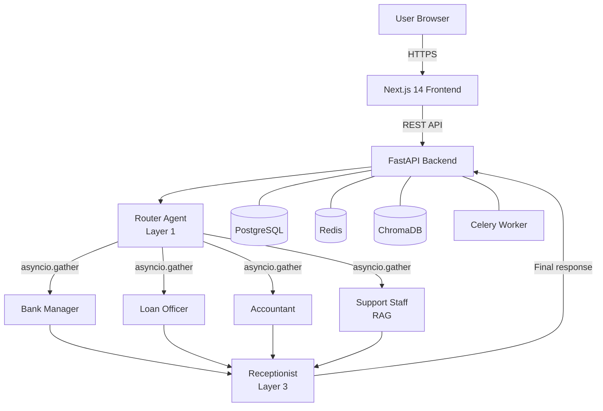

# ADX Bank

> AI-powered digital banking platform with multi-agent architecture


**[Live Demo](#quick-start)** · **[Architecture](#architecture)** · **[Tech Stack](#tech-stack)**

<!-- Add dashboard screenshot here -->

---

## Key Features

| Feature | Description |
|---|---|
| 3-Layer Multi-Agent AI | Router → 4 parallel specialists → Receptionist combines responses |
| LLM Fallback Chain | Groq → OpenAI → Claude — automatic failover, zero downtime |
| RAG Knowledge Base | ChromaDB + ONNX embeddings (~50 MB, no PyTorch) over bank policies |
| OTP-Secured Transactions | Every transfer, loan, and top-up requires email OTP verification |
| Real-time Loan Simulator | Live EMI calculation with principal/interest breakdown |
| Background Task Engine | Celery + Redis for async OTP emails and scheduled jobs |

---

## Architecture



---

## Multi-Agent Pipeline

The AI assistant uses three layers, each with a single responsibility:

**Layer 1 — Router** (`app/ai_agents/assistant/agent.py`)
Analyses the user's message, splits it into sub-queries, assigns each to a
specialist agent with the minimum context required. Runs once per user turn.

**Layer 2 — Domain Agents** (`app/ai_agents/*/agent.py`)
Four specialists run **concurrently** via `asyncio.gather`:
- `bank_manager` — account summaries, financial health, spending advice
- `loan_officer` — eligibility, EMI, foreclosure
- `accountant` — transaction analysis, payment tracking
- `support_staff` — RAG over bank policies (ChromaDB + ONNX)

**Layer 3 — Receptionist** (`app/ai_agents/receptionist/agent.py`)
Merges all specialist responses into one coherent reply, deduplicates
redirect actions, and returns the final answer to the user.

---

## Quick Start

```bash
# 1. Clone
git clone https://github.com/eshangoel-tech/adx-bank-platform.git
cd adx-bank-platform

# 2. Configure
cp .env.example .env
# Edit .env — fill in POSTGRES_PASSWORD, JWT_SECRET, and at least one AI key

# 3. Run everything
docker-compose up --build

# Frontend:       http://localhost:3000
# Backend docs:   http://localhost:8000/docs
```

**Or run services individually:**

```bash
# Terminal 1 — Backend API
cd backend && pip install -r requirements.txt
uvicorn app.main:app --reload

# Terminal 2 — Celery worker
cd backend
celery -A app.config.celery.celery_app worker --loglevel=info

# Terminal 3 — Frontend
cd frontend && npm install && npm run dev
```

---

## Tech Stack

| Layer | Technology |
|---|---|
| Frontend | Next.js 14, TypeScript, Tailwind CSS, Framer Motion |
| Backend | Python 3.12, FastAPI, SQLAlchemy 2.0, Pydantic v2 |
| AI / LLM | LangChain, Groq (Llama 3.3), OpenAI (GPT-4o-mini), Claude (Haiku) |
| Vector DB | ChromaDB, ONNX MiniLM-L6-v2 embeddings |
| Database | PostgreSQL 16, Alembic migrations |
| Cache / Queue | Redis 7, Celery |
| Auth | JWT (PyJWT), bcrypt, email OTP |
| DevOps | Docker, Docker Compose, GitHub Actions |

---

## Project Structure

```
adx-bank-platform/
├── frontend/                  ← Next.js 14 app
│   ├── src/app/              ← Pages: dashboard, transfer, loans, assistant, landing…
│   ├── src/components/       ← Navbar, PageTransition, StaggerContainer, Spinner…
│   └── src/services/api.ts   ← Axios instance with JWT interceptor
│
├── backend/                   ← FastAPI app
│   ├── app/ai_agents/        ← Multi-agent pipeline (router + 4 specialists + receptionist)
│   ├── app/services/ai/      ← LLM utils (fallback chain), RAG, context fetching
│   ├── app/services/core/    ← Auth, transfer, loan, wallet business logic
│   ├── app/repository/       ← SQLAlchemy models + repository pattern
│   ├── app/api/              ← FastAPI route handlers
│   └── app/config/           ← AI config, bank policies JSON, Celery, Redis, DB
│
├── docker-compose.yml         ← Unified: API + Celery + Postgres + Redis + Frontend
├── .env.example               ← Environment variable template
└── .github/workflows/ci.yml  ← CI: lint + test + build
```

---

## License

MIT © 2025-2026 [Eshan Goel](https://github.com/eshangoel-tech)
